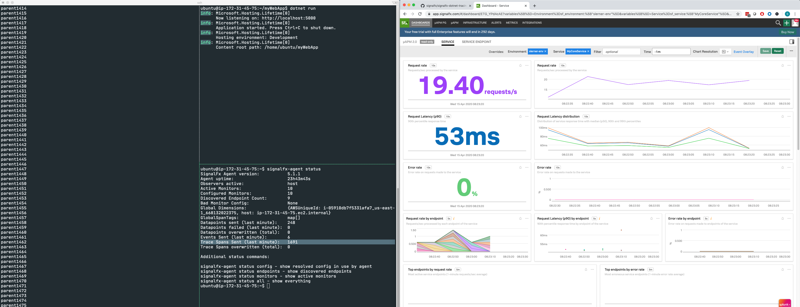

## SignalFx Microservices APM Quick Start Examples


---

### 1. Requirements and Document Conventions

#### **Document Conventions**

Variables that require you to alter them based on information in your environment are displayed like this: YOURVARIABLEHERE. For example if you need to set your realm to `us1` in a hostname you'd change `api.YOURREALMHERE.signalfx.com` to `api.us1.signalfx.com`

#### **Requirements**

To use these examples you must have the following installed:

1. Linux system

2. Signalfx Account

3. Configuration of SignalFx SmartAgent for uAPM as shown here: https://docs.signalfx.com/en/latest/apm2/apm2-getting-started/apm2-smart-agent.html

   1. Ensure that you can see your host in the SignalFx dashboard and that the YAML values required for tracing as shown above are correct before proceeding

4. The following environment variables set correctly unless otherwise specified:

Using Linux environment style:

```
export SIGNALFX_SERVICE_NAME="YOURAPPNAMEHERE"
export SIGNALFX_ENDPOINT_URL="http://localhost:9080/v1/trace"
export SIGNALFX_ACCESS_TOKEN="YOURTOKENHERE"
```

Many of these examples involve running the traced application on same instance as exercising that application i.e. running a Python Flask webserver and then using CURL to exercise the Flask webserver and therefore generating traces.

`tmux` is recommended to split your terminal into several panes so that you can run webserver in one pane, exercise with CURL in another, and check status of SignalFx agent in another. 

Note that you must always CHECK THAT ENVIRONMENT VARIABLES ARE SET each time you create a new `tmux` pane.

To install tmux:

`sudo apt-get install tmux`

Using tmux looks as follows:


