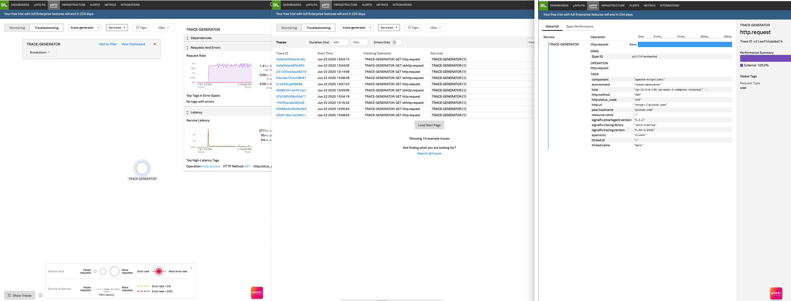

# SignalFx APM Trace Generator Demo For AWS ECS Fargate

This repo demonstrates a reference implemenation for a single AWS ECS Fargate task example of Splunk SignalFx APM.

The single task spins up two ECS Fargate containers:

#1 SignalFx-Agent - sidecar to observe ECS and relay traces to SignalFx   
#2 Trace-Generator - generates 1000 traces using two frameworks   

### SETUP
The agent is a standard deployment of a SignalFx Fargate container as documented here:
https://github.com/signalfx/signalfx-agent/blob/master/deployments/fargate/example-fargate-task.json

The agent.yaml file is based on the Fargate Example here:
https://github.com/signalfx/signalfx-agent/blob/master/deployments/fargate/agent.yaml

However it has been configured for APM with instructions here:
https://docs.signalfx.com/en/latest/apm/apm-getting-started/apm-smart-agent.html

The result is this file here- to use this you must change the REALM of the trace endpoint url (or set it as an environment variable) in the `tgsfx.json` task definition.
https://raw.githubusercontent.com/slernersplunk/signalfx/master/apm/agent/fargate/agent.yaml

To deploy this example, you must have a Fargate ECS environment ready to go with VPC, task roles for logs, etc..

Everything to test this example follows the ECS tutorial documentation here:
https://docs.aws.amazon.com/AmazonECS/latest/developerguide/ECS_AWSCLI_Fargate.html

And log environment tutorial here:
https://docs.aws.amazon.com/AmazonECS/latest/developerguide/using_cloudwatch_logs.html

Once all of the above is done:

### STEP 1
Deploy with the following commands- change the variables in caps to suit your environment:
```
aws ecs register-task-definition --cli-input-json file://tgsfx.json
```
### STEP 2
Create the service based on the task just registered:
`aws ecs create-service --cluster test-cluster --service-name signalfx-demo --task-definition signalfx-demo:1 \`    
`--desired-count 1 --launch-type "FARGATE" \`    
`--network-configuration "awsvpcConfiguration={subnets=[subnet-YOURSUBNETIHERE],securityGroups=[sg-YOURSECURITYGROUPIDHERE],assignPublicIp=ENABLED}"`

Note that the task definition will increment each time you try it- from 1 to 2 etc... 
To check which version is current use:

`aws ecs list-task-definitions`

### STEP 3

#### Note that this demo does not generate RED metrics- only traces! 

Click "Troubleshoot" in your APM console, make sure you are in the `trace-generator environment` by clicking on the pulldown menu next to "Troubleshoot", and click "Show Traces" from lower left of screen to see traces. 

See below left of furthest left screen for this link.

Two frameworks are being used by the trace generator to get URLs: OKHTTP and Apache.
The Java file used is here: https://raw.githubusercontent.com/slernersplunk/signalfx/master/apm/apm-java/http-requests/src/main/java/sf/main/GetExample.java

The screenshot below shows what the traces will look like.



### How it works

The key to this working is that the trace generator container is sending its traces to ```localhost``` which is network addresss shared with the agent container. The agent running in the agent container sees these traces and has been configured to send them to SignalFx.

The trace generator is using the automatic instrumentation for tracing from SignalFx and uses the OkHTTP and Apache http request libraries to request a neutral external website (set up in the Java code) once per second, 1000 times.

### Extras

The **commands.md** file offers helpful commands for ECS Fargate management for the AWS CLI.

Dockerfile for the java trace generator is here: https://raw.githubusercontent.com/slernersplunk/signalfx/master/apm/containers/dockerfile-tracegenerator-java
